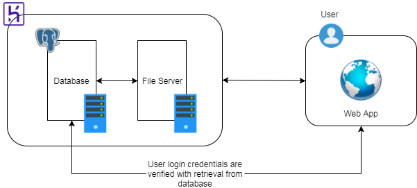
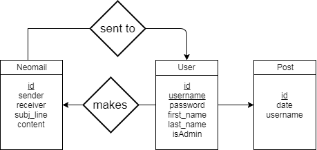
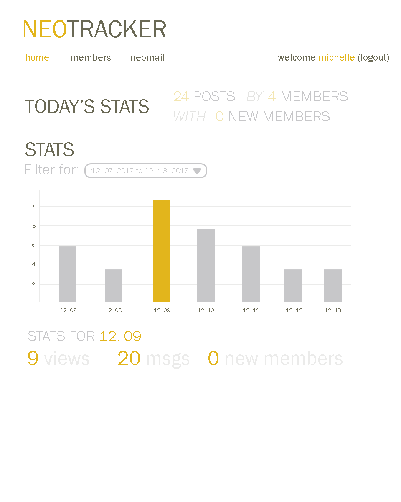
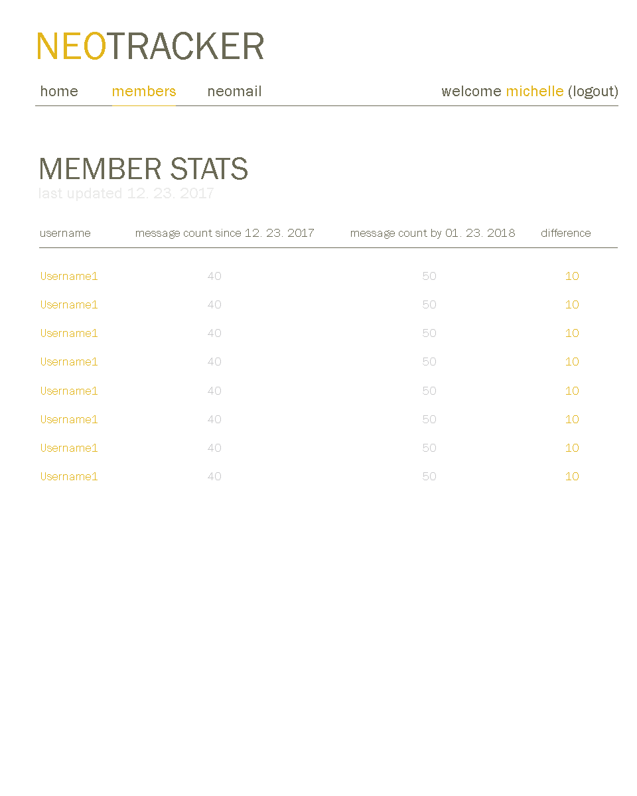
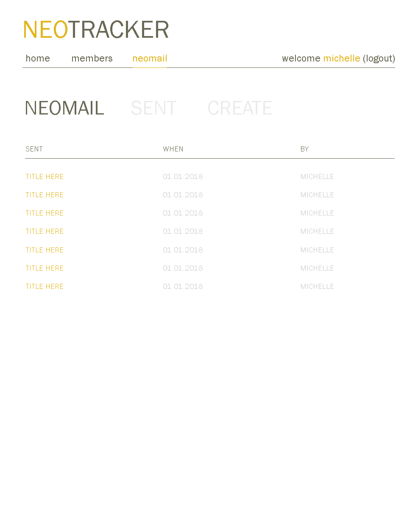
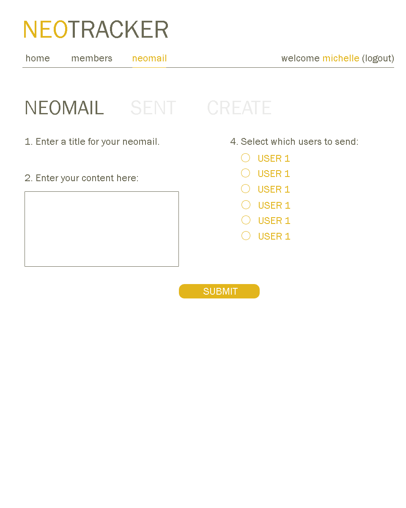
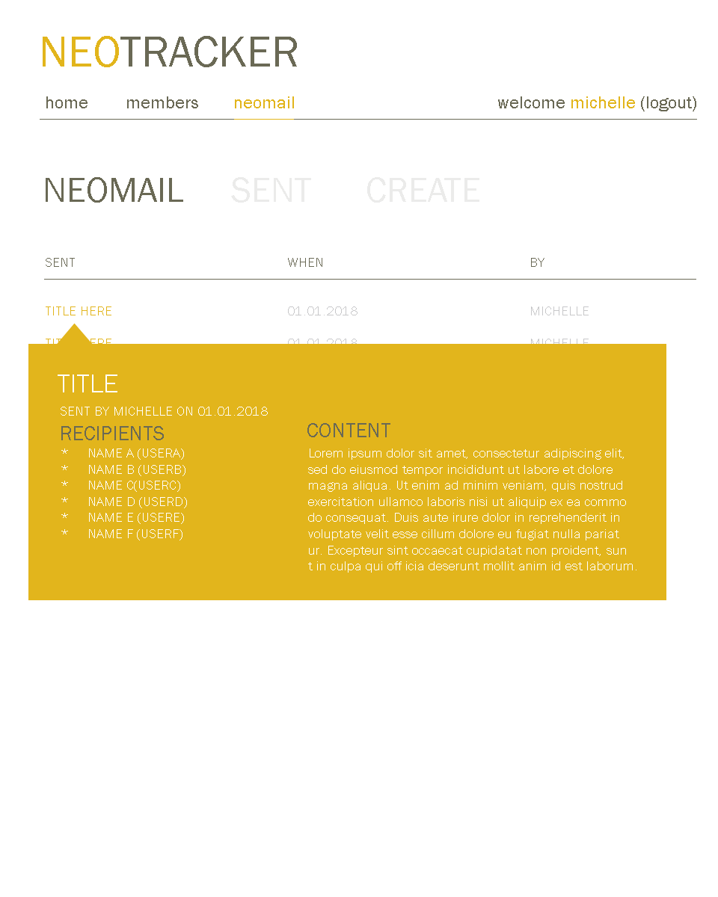

# neotracker
an application that tracks and monitors guild activity

## dev timeline
1. [x] `12.23.2017` Create application mockups
2. [x] `12.24.2017` Create UML mockup
3. [ ] `12.25.2017` to `01.12.2017` Development period
4. [ ] `01.13.2017` to `01.19.2017` Debugging
5. [ ] Integrate ReactJS if available/time

## porpoise 🐬 
Maintaining a guild in [Neopets](http://www.neopets.com) is a legit job. You have to be quick to address faltering member activity and see what events work and what events don't.

After running MuxHo, an anime/manga guild, for three years, I've decided to create an application that visualizes and monitors member activity. It tracks how many members posted, who are posting, and how many views the guild is getting.

This will give me and other council members a better idea of how the guild is performing and when and allow us to make connections how the guild activity corresponds to how much effort we are putting in.

## uml component diagram 📈

## er diagram

## mockup 🎨
    

## tutorial links
- [Project Settings for a NodeJS Express app with PSQL](https://medium.com/@HalahSalih/project-settings-for-an-express-app-with-knex-16959517b53b)
- [How to Deploy An Express App to Heroku with Postgresql Database Using Git](https://medium.com/@HalahSalih/how-to-deploy-an-express-app-to-heroku-with-postgresql-database-using-git-266e100d59ff)
- [Setting up NodeJS with a database](https://hackernoon.com/setting-up-node-js-with-a-database-part-1-3f2461bdd77f)
